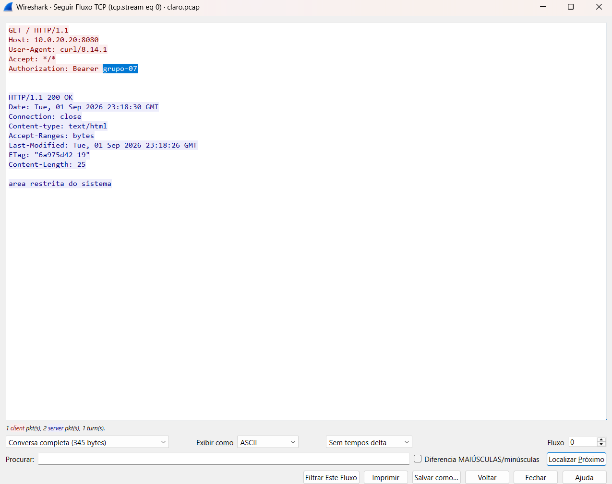

# Cartilha — "Senha sem cadeado"

Material de **extensão** da Entrega 5. Público-alvo: gente que não estuda
redes — familiares, outra turma, uma associação de bairro, uma escola.

Arquivo: [`cartilha.html`](cartilha.html). Abre em qualquer navegador, sem
servidor e sem internet (só as fontes vêm do Google Fonts; sem elas o texto
continua legível nas fontes de sistema).

## O que falta para ela ficar pronta

Duas coisas, e as duas são de vocês:

1. **A imagem central tem de ser a captura do grupo.** O enunciado é explícito
   sobre isso — não vale figura da internet. Na seção "A evidência do nosso
   grupo" há um bloco tracejado marcando o lugar. Depois de rodar
   `make verificar E=5`, abram `claro.pcap` no Wireshark, use *Follow → TCP
   Stream*, deixem visível a linha `Authorization: Bearer <token do grupo>`,
   tirem o print, salvem como `captura-http.png` nesta pasta e troquem no HTML:

   ```html
   <!-- de: -->
   <div class="slot"> … </div>
   <!-- para: -->
   
   ```

2. **O nome do grupo no rodapé**, no lugar de `[nome do grupo]`.

## Para imprimir

O arquivo tem folha de estilo de impressão: no navegador, *Imprimir → Salvar
como PDF* sai como folheto, sem o fundo colorido e sem quebrar seções no meio.

## Os três degraus da nota

A nota de extensão depende de o material **sair da sala** — não é o professor
o público:

| Nível | O que precisa existir |
|---|---|
| **1,2** | verificação verde, os dois `.pcap` no repositório, e esta cartilha pronta com a captura do próprio grupo |
| **1,7** | + apresentada a um público real fora da sala, **com registro**: foto, lista de presença ou gravação |
| **2,0** | + evidência de retorno: quantas pessoas alcançadas, o que perguntaram, e uma **versão revisada depois** do que vocês ouviram |

O degrau de 2,0 é o que exige ouvir e mudar. Guardem as perguntas que o
público fizer — elas são a matéria-prima da revisão, e a diferença entre o
antes e o depois do material é o que vocês mostram na apresentação.

Sugestão prática: depois da apresentação, criem `cartilha-v2.html` em vez de
sobrescrever esta. Ter as duas versões lado a lado no repositório **é** a
evidência de retorno.

## O que registrar

Anotem aqui mesmo, logo depois de apresentar:

- **Onde e quando:**
- **Para quem, e quantas pessoas:**
- **O que perguntaram / o que não entenderam:**
- **O que mudamos por causa disso:**
